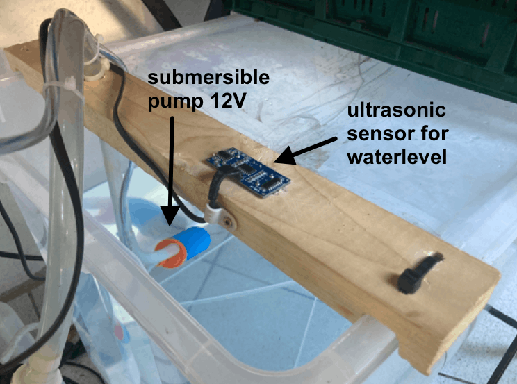
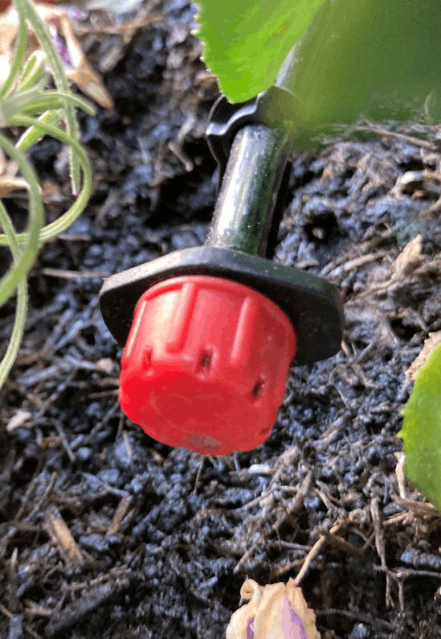
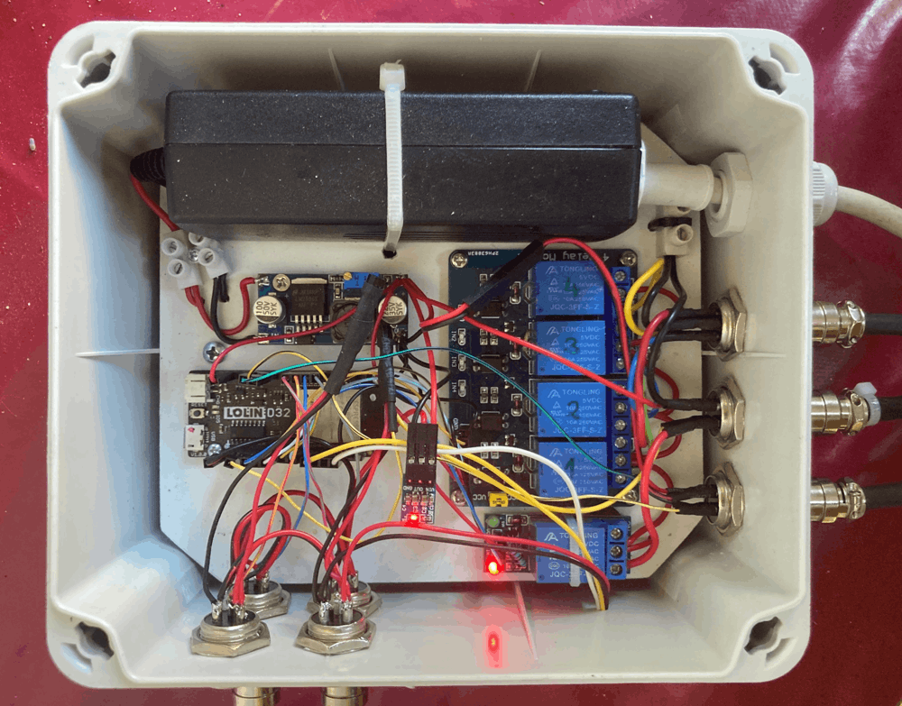
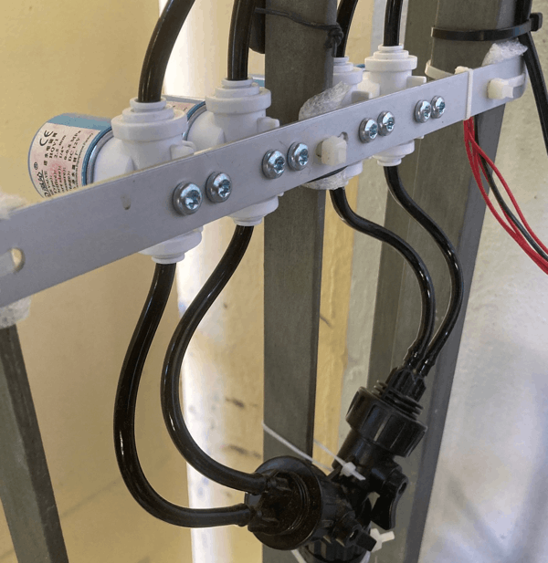
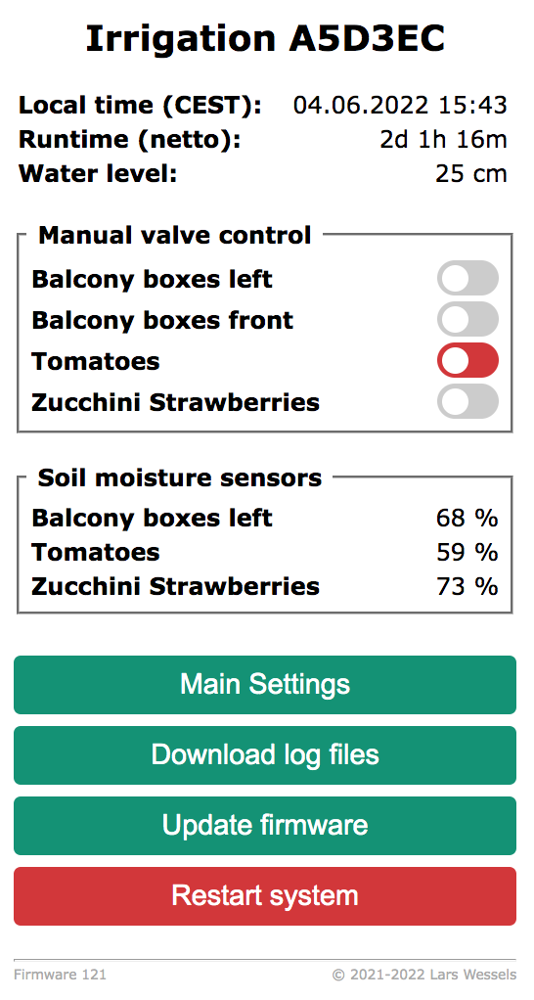
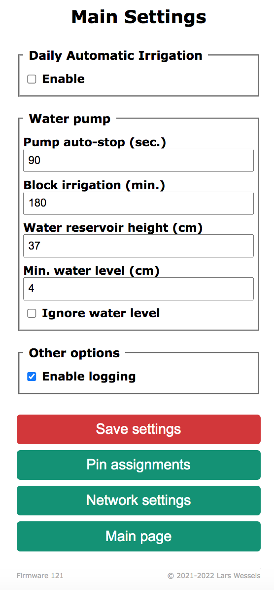
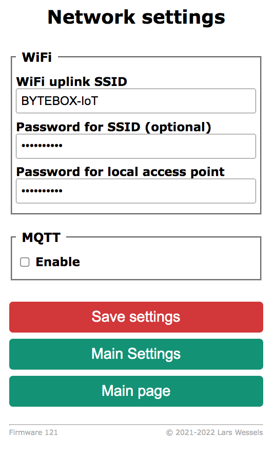

# Irrigation Automation (ESP32/MQTT)

Last year, some plants on our balcony died (once again) due to lack of water.
Regular watering especially in midsummer is just mandatory. :innocent:

To make watering less time consuming I ordered a [simple drip
irrigation](https://www.amazon.de/s?k=tropfbew%C3%A4sserung) system for
about 15 Euros on Amazon and installed it to water at least the tomato
plants and few balcony boxes. Since we do not have a water tap on the
balcony, the water has to be pumped from a water reservoir ([large
plastic box](https://www.hornbach.de/shop/Kunststoffbox-DIRK-XL-60-l/8493771/artikel.html)
with 60 liters capacity). First attempts with an old aquarium pump (14W)
failed due to insufficient water pressure for the long and thin hoses of
the drip system. With a small submersible pump from campings supplies
for about 20 Euros ([Barwig Typ 04 with orange top](https://www.amazon.de/s?k=barwig+tauchpumpe+12v),
12V, 10 l/min) irrigation triggered once a day or remotely using a [Sonoff
Basic](https://tasmota.github.io/docs/devices/Sonoff-Basic/#sonoff-basic-r2)
with [Tasmota](https://tasmota.github.io/docs/) worked more or less as expected.

 
&nbsp;&nbsp;&nbsp;
 

However, one thing that really annoyed me for the rest of the summer, was
the proper dosage of water for the different plants. Numerous adjustments
to the little red drip valves in the four main branches of the irrigation
system did not produce the desired results. Some plants were over-watered
others needed an extra shot from a water can.

When we began to grow the tomatoes this April, I decided to improve
and automate the drip system with an ESP32 which should receive commands
from automations in [Home Assistant](https://www.home-assistant.io). The
basic idea was to control the four irrigation branches separately with
solenoid valves, which are controlled via MQTT just like the main pump.
In addition, some sensors should regularly report soil moisture to Home
Assistant to better control irrigation depending on weather conditions.
I looked around on GitHub but didn't find a project that met my needs,
so I build just another irrigation system. :blush:

## Features

- water pump and 4 solenoid valves can be controlled via MQTT e.g. Home Assistant
- controller settings can be adjusted via web interface (available in German/English)
- offers simple stand-alone scheduler to water plants once a day
- ultrasonic sensor ensures minimal water level in reservoir
- only one valve can be opened at a time to maximize pressure on each dripping branch
- valves will switch off after preset time and then blocked to avoid accidental over-watering
- writes events and sensor readings to log file in ESP32 flash including log rotation
- creates a local access point for initial system setup or if no Wifi is available
- OTA firmware updates

## Hardware components

- ESP32 development board (Wemos Lolin32)
- 4 channel relay module board (5V)
- 4 solenoid valve [HQV1](https://www.aliexpress.com/wholesale?SearchText=HQV1) G 1/4" (12V, normaly closed)
- 4 [capacitive soil moisture sensors v1.2](https://www.aliexpress.com/wholesale?SearchText=capacitive+moisture+sensor) (with TLC555)
- single channel relay board (5V) to switch pump
- ultrasonic ranging sensor [HC-SR04](https://tasmota.github.io/docs/HC-SR04/)
- HTU21D temperature and humidity sensor (optional)
- 12V/3A power supply (must provide enough power for 12V pump)
- adjustable step-down converter LM2596S (12V -> 5V)
- 3.3V regulator board (AMS1117-3.3)
- 5V to 3.3V level shifter or BC547 and 10k resistor
- several GX16 male/female connectors for valves, sensors, etc.
- dupont jumper wires and connectors
- waterproof housing

When you buy the capacitve sensors make sure these have a TLC555 timer chip.
The sensors I ordered on AliExpress were all fitted with NE555 chips which I
had to replace with TLC555s. The older NE555 requires a minimum 4.5V supply voltage
and thus cannot be powered with 3.3V. If you power the sensor with 5V the output
voltage on the AOUT pin should not be connected directly to the 3.3V A/D input
pin of the ESP32. If you have sensors with NE555s and no TLC555s to solder at hand
you could also use a [multi-channel level-shifter](https://www.makershop.de/module/schnittstellen/5x-4-kanal-logic-level-shifter/)
to adjust the AOUT voltage from 5V to 3.3V.

Robert Jakus wrote an [excellent and extensive article](https://thecavepearlproject.org/2020/10/27/hacking-a-capacitive-soil-moisture-sensor-for-frequency-output/) on the capacitve soil sensors. Please note, that you
need to make the sensor board water resistant with heat shrink tubes, hot glue,
nail polish or liquid tape before they are used.

## Schematics

 

The BC547 and the 10k resistor form a simple level shifter for the echo pin of
the HC-SR04, which runs at 5V. You might get along without it, but keep in mind
that the ESP32 input pins are not 5V tollerant.

 
&nbsp;&nbsp;&nbsp;
 

## Firmware upload

To compile the firmware for the ESP32 controller just download [Visual
Studio Code](https://code.visualstudio.com/) and install the [PlatformIO
add-on](https://platformio.org/install/ide?install=vscode). Open the project
directory and adjust the settings in `include/config.h` to your needs. Most
options can also be changed via the web interface. Settings are stored in the
[NVS](https://docs.espressif.com/projects/esp-idf/en/latest/esp32/api-reference/storage/nvs_flash.html)
of the ESP32 to survive a reboot or a shutdown.

Since the software was developed on a MacBook you might need to adjust the [upload port
settings](https://docs.platformio.org/en/stable/projectconf/section_env_upload.html)
in the section `[common]` in `platformio.ini`. For further firmware updates
use the OTA option in the web interface.

## Initial setup and configuration

On first boot up the ESP32 will start a local access point with the SSID
`Irrigation-System-XXXXXX` with password `__secret__` on IP 192.168.4.1 for
initial configuration unless you preset your Wifi credentials in `include/config.h`
at compile time. Set your SSID and password under network settings and
reboot the system.

After successful connection to your Wifi the ESP32 will request an IP address
from your router or DHCP server (check output on serial monitor). Point your
favorite browser to the controllers IP and configure pin assignments and labels
for the valves and optional the soil moisture sensors if not alredy preset
in `include/config.h`. Then you need to set the distance from the HC-SR04
sensor pointing to the bottom of the water reservoir and the minimum water
level to keep the submersible pump under water at all times.

 
&nbsp;&nbsp;&nbsp;&nbsp;&nbsp;&nbsp;
 

You can trigger the valves via the web interface (only one at a time) or by publishing
`on` or `off` to the controller's MQTT command topic e.g. `irrigation/cmd/valve1 on`.
Please note that a valve is blocked for a configurable number of minutes before it can
be opened again (see reddish switch in screenshot above). This should prevent accidental
over-watering. If you reboot the controller all valves are unblocked. The current
state of the irrigation controller is published as a JSON to the configured MQTT broker
on the topic `irrigation/state` every 60 seconds. MQTT topics and publish interval can
be set on the network settings page or preset in `include/config.h`

If you don't use Home Assistant or some other service to control the irrigation system,
you can schedule the 4 valves to open for a given number of seconds at a preset time
once a day. This schedule might also serve as a fallback option if, for example,
Home Assistant usually triggers watering a few minutes before.

## Contributing

Pull requests are welcome! For major changes, please open an issue first to discuss
what you would like to change.

## License

Copyright (c) 2021-2022 Lars Wessels  
This software was published under the Apache License 2.0.  
Please check the [license file](LICENSE).
